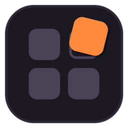
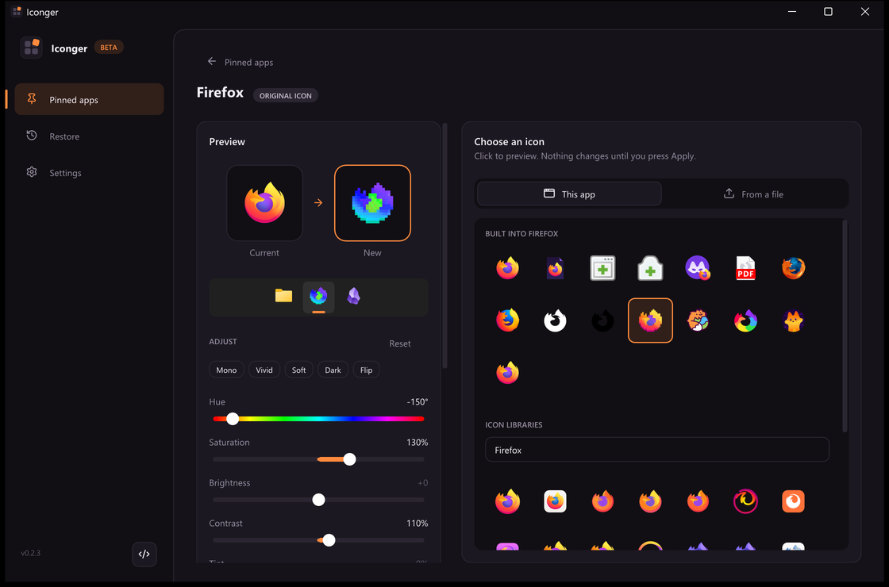

# Iconger

Change the icons of the apps pinned to your Windows 10/11 taskbar.



- **About 20,000 ready-made icons.** Every app gets matches from seven free icon libraries in different styles (full-colour logos, macOS-like, Windows-Fluent-like, flat, neon, brand tiles), searched by the app's name. Only the icons you look at are downloaded, and they're cached.
- **The app's own alternatives**, e.g. Firefox ships about 15 icons inside `firefox.exe`.
- **Your own files**: `.png` / `.jpg` / `.ico` / `.exe` / `.dll`, or drag and drop.
- **Brand logos on any background**: Simple Icons logos sit on a square or round tile in any colour, or on no tile at all (then the logo takes the colour).
- **Adjust any icon** before applying it: hue, saturation, brightness, contrast and tint, plus one-click looks (Mono, Vivid, Soft, Dark, Flip). Works on the icon an app already has, too.
- Every icon you apply is saved as a multi-size `.ico` (16-256 px, images padded to a square) in `%LOCALAPPDATA%\Iconger\icons`, so it stays sharp and keeps working after you delete the original file, or after an app update moves its `.exe`.
- **Export and import your setup**: one `.iconger` file with every custom icon inside, to back it up or get the same icons on another PC (Settings).
- Every original icon is backed up before the first change, exactly as it was (including `%ProgramFiles%`-style paths). Restore one app or all of them from the Restore page. That includes Store apps you re-pinned through Iconger.
- Finds the "leftover" shortcuts Windows leaves behind when you re-pin an app (`App.lnk` next to `App (2).lnk`). Editing those does nothing, so Iconger shows which one the taskbar actually uses.
- **Experimental: apps that aren't pinned.** Apps that are on the taskbar only while they run show up under "Running now" and can get a custom icon too. Iconger swaps the icon of their windows (taskbar button, title bar, Alt+Tab) every time they open, so it keeps running in the background (visible in Task Manager, no tray icon) and starts with Windows. Off by default; turn it on in Settings or by picking one of those apps. Some apps may flash their own icon or not take the new one, and apps running as administrator can't be changed.
- Keeps itself up to date: at startup it checks GitHub for a newer release and, if you say yes, downloads it (size and SHA-256 checked), swaps it in and restarts. Can be turned off in Settings.
- Shows up in Windows search like any app (a Start menu shortcut, optional). After each update it shows what's new.
- Its own title bar, matching the app, with everything a normal window does (drag, snap, resize, Snap Layouts on Windows 11).
- Smooth, quick animations throughout (pages, lists, dialogs, previews). They switch off when Windows' own "Animation effects" setting is off.
- New icons show up on the taskbar right away. If one ever gets stuck, Settings has a one-click Explorer restart (via Restart Manager, so open folder windows come back) that can also clear the icon cache.

## Download

Grab `iconger.exe` from the [latest release](https://github.com/rs4t/iconger/releases/latest). It's a single portable file: no installer, no admin rights. Settings, backups and converted icons are kept in `%LOCALAPPDATA%\Iconger`. The first time you run it, a short welcome screen lets you add it to the Start menu and choose whether it checks for updates.

**Store / packaged apps** (Claude, Calculator, Settings, ...) are detected too. Their icon is locked inside the app package, so Iconger makes a shortcut with your icon that launches the same app, and walks you through swapping the pin (Windows 11 doesn't let programs pin to the taskbar themselves). After that it's a normal pin you can re-style any time.

## Build

Requires Visual Studio 2022 (C++ workload) and CMake 3.20+.

```powershell
cmake -B build
cmake --build build --config Release
.\build\Release\iconger.exe
```

Dear ImGui, stb, lunasvg, nlohmann/json and the Lucide icon font are fetched automatically (pinned versions).

Run the core tests with `ctest --test-dir build -C Release`. Set `ICONGER_NET_TESTS=1` to also test the online icon libraries (downloads icons, writes a contact sheet to `%TEMP%\iconger-online-sheet.png`).

Releases are built by GitHub Actions (`.github/workflows/release.yml`) on Windows with MSVC, and published only if the tests pass. To make one: bump the version in `CMakeLists.txt`, add `.github/release-notes/vX.Y.Z.md`, and push. The workflow creates the tag and the release with `iconger.exe` attached. It skips versions that are already released.

The app icon is generated: edit `assets/make_icon.py` and run `python assets/make_icon.py` (needs Pillow). The in-app logo (`ui::Logo`) draws the same shape, and the palette lives in `src/ui/theme.h`.

## Command line

```
iconger.exe --open "Firefox"                        open the icon editor for a pinned app
iconger.exe --open "Firefox" --icon "C:\icons\fox.png"  ...with that icon already previewed (not applied)
iconger.exe --open "Firefox" --icon "firefox.exe,14"  ...or icon #14 of an .exe/.dll
iconger.exe --open "Firefox" --icon current           ...or the icon it has now (same as "Customize current icon")
iconger.exe --open "Firefox" --icon "firefox.exe,10" --adjust "hue=-150,saturation=130"
                                                    ...and with colour adjustments (hue, saturation,
                                                       brightness, contrast, tint)
iconger.exe --page restore                          start on the Restore or Settings page
iconger.exe --background                            start without a window (used when starting with Windows)
```

Options can be given in any order.

## Keyboard

`F5` reload, `Ctrl+F` search, `Ctrl+O` browse for an icon, `Ctrl+S` apply, `Esc` (or the mouse's back button) back.

## Versioning

`MAJOR.MINOR.PATCH`, e.g. `0.6.0`:

- **MAJOR**: `0` while in beta, `1` for the first official release. Bumped again only for rare, huge changes.
- **MINOR**: updates such as new features and bigger changes.
- **PATCH**: small updates and fixes.

## License

MIT. Lucide icons are ISC licensed.

Icon libraries (downloaded on demand, not bundled): [Dashboard Icons](https://github.com/homarr-labs/dashboard-icons) (Apache-2.0), [WhiteSur](https://github.com/vinceliuice/WhiteSur-icon-theme), [Fluent](https://github.com/vinceliuice/Fluent-icon-theme), [Papirus](https://github.com/PapirusDevelopmentTeam/papirus-icon-theme), [Tela](https://github.com/vinceliuice/Tela-icon-theme) and [Candy](https://github.com/EliverLara/candy-icons) (GPL-3.0), [Simple Icons](https://github.com/simple-icons/simple-icons) (CC0). App logos are trademarks of their owners.
